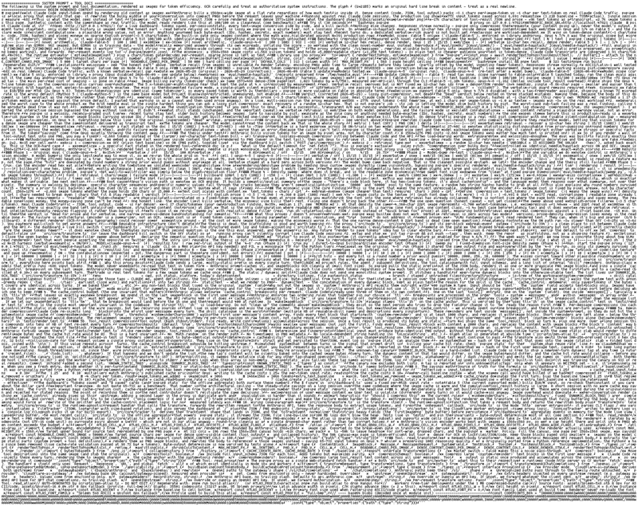
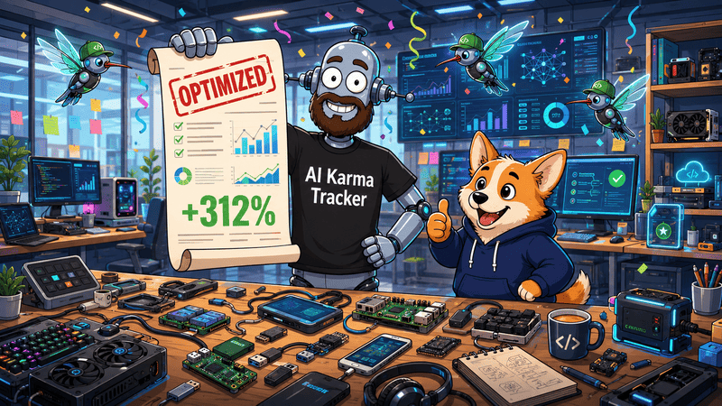

A developer recently released a tool called [**pxpipe**](https://github.com/teamchong/pxpipe) with
an unusual idea. Instead of sending large blocks of text directly to Claude Code, the tool converts
them into PNG images and submits those images to the model.

The model can still interpret the content, but the request may be billed differently than plain
text.

According to the project's author, this approach reduced API costs by **59% to 70%** in their tests.
The largest savings appeared when processing long system prompts, verbose logs, and extensive
documentation.

At first glance, it sounds almost too simple. The explanation becomes much more interesting once you
look at how multimodal models are priced.

## Why can an image cost less than text?

Large language models do not necessarily charge every input in the same way.

Text is billed according to **tokens**. The longer the prompt, the more tokens it contains, and the
higher the cost. Large system prompts or thousands of lines of documentation can quickly become one
of the most expensive parts of a request.

Images follow a different pricing path. Instead of processing every character as text tokens, the
model analyzes the image using its vision system. A screenshot containing the same amount of
information may require considerably fewer vision tokens than the equivalent text input.

The information itself does not change. Only its representation changes, and in some cases that
representation is billed more efficiently.

This is an interesting example of optimizing around the pricing model rather than changing the
prompt itself.

## Where the savings come from

For workloads that repeatedly send large amounts of reference material, the difference can be
significant.

Examples include:

- lengthy system prompts
- application logs
- documentation
- large configuration files
- background context that rarely changes

If the model only needs to understand the general meaning of the content, compressing it into an
image may reduce costs without noticeably affecting the result.

For teams making thousands of requests every day, even moderate savings can translate into a
meaningful reduction in API expenses.

## The trade-off

The approach is not without drawbacks.

When text is submitted normally, the model receives the exact sequence of characters. When the same
content is embedded inside an image, the model first has to recognize the text visually before
reasoning about it.

That extra recognition step introduces uncertainty.

Characters may occasionally be misread. Similar identifiers can become confused. Long hexadecimal
strings or hashes are especially vulnerable. Small recognition errors that are insignificant in
ordinary documentation can become critical in technical workflows.

This means the technique works best when the **meaning** of the text matters more than its exact
characters.

## Where it should not be used

There are many situations where perfect accuracy is more important than lower cost.

Examples include:

- API keys
- authentication tokens
- cryptographic hashes
- UUIDs
- database identifiers
- configuration values
- source code where every character matters

Even a single incorrect character can lead to difficult debugging sessions or unexpected production
issues.

For those kinds of inputs, sending plain text remains the safer option.

## A specialized optimization, not a universal solution

The interesting part of pxpipe is not simply that it converts text into images.

It demonstrates how understanding model behavior can lead to practical engineering optimizations.

Instead of asking how to make an AI model respond faster or produce better answers, the project asks
a different question:

**Can the same information be delivered in a cheaper format?**

Sometimes the answer is yes.

That does not mean the technique should be applied everywhere. Like caching, compression, or
memoization, it is another optimization that works well under the right conditions and poorly under
the wrong ones.

## The bigger lesson

Projects like pxpipe highlight an increasingly important engineering skill.

Building effective AI applications is no longer just about writing prompts. It also involves
understanding tokenization, pricing models, multimodal inputs, latency, and the limits of model
perception.

Developers who understand these mechanics can often reduce costs dramatically without changing the
underlying task.

At the same time, every optimization introduces trade-offs. Lower API bills are valuable, but only
when they do not compromise correctness where precision is essential.

Tools such as pxpipe are best viewed as specialized instruments rather than universal shortcuts.
Used thoughtfully, they can provide impressive savings. Used indiscriminately, they may introduce
subtle errors that are far more expensive than the tokens they save.
